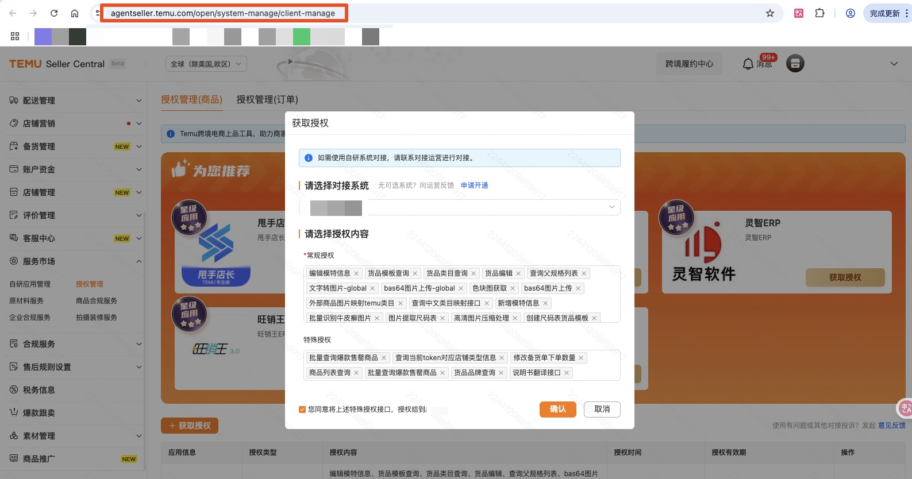

# PA网关调用说明
- 目录：API文档 / 【必读】PA网关
- Doc ID：929750644349
- Document ID：161805618337
- 来源：https://agentpartner.temu.com/document?cataId=875198836203&docId=929750644349PA网关调用说明

更新时间：2026-05-06 21:14:35

# 一、网关更换说明

部分接口已迁移至partner网关

1、需要将调用地址改为partner网关地址：https://openapi-b-partner.temu.com/openapi/router

2、更换接口type

3、重新授权获取新的token，获取授权路径：https://agentseller.temu.com/open/system-manage/client-manage

# 二、已迁移的接口如下，未列出的接口仍使用原CN网关

（接口文档需要三方ERP入驻/自研应用绑定后查看，游客账号无法访问）

## 2025-06 迁移

接口组

接口

新接口type（PA网关）

原接口type

基础API组

查询当前token对应授权信息

[bg.open.accesstoken.info.get.global](https://agentpartner.temu.com/document?cataId=875198836203&docId=929722395417)

bg.open.accesstoken.info.get

半托库存API组

半托管新增路由绑定及库存填写接口

[bg.btg.goods.stock.route.add](https://agentpartner.temu.com/document?cataId=875198836203&docId=931819715810)

bg.goods.routestock.add

半托管销售库存更新接口

[bg.btg.goods.stock.quantity.update](https://agentpartner.temu.com/document?cataId=875198836203&docId=929727846558)

bg.goods.quantity.update

查询半托管商品销售库存

[bg.btg.goods.stock.quantity.get](https://agentpartner.temu.com/document?cataId=875198836203&docId=929728959750)

bg.goods.quantity.get

根据站点查询可绑定的发货仓库信息接口

[bg.btg.goods.stock.warehouse.list.get](https://agentpartner.temu.com/document?cataId=875198836203&docId=929731654843)

bg.goods.warehouse.list.get

半托调价API组

（仅自研应用）

半托管批量确认/拒绝调价单

[bg.semi.adjust.price.batch.review.order](https://agentpartner.temu.com/document?cataId=875198836203&docId=931820964658)

bg.semi.adjust.price.batch.review

分页查询半托管调价单

[bg.semi.adjust.price.page.query.order](https://agentpartner.temu.com/document?cataId=875198836203&docId=931822060910)

bg.semi.adjust.price.page.query

半托核价API组

（仅自研应用）

分页查询半托管核价单

[bg.semi.price.review.page.query.order](https://agentpartner.temu.com/document?cataId=875198836203&docId=929730272138)

bg.price.review.page.query
（注意全托仍使用原接口）

半托管同意核价单建议价

[bg.semi.price.review.confirm.order](https://agentpartner.temu.com/document?cataId=875198836203&docId=929730556932)

bg.price.review.confirm
（注意全托仍使用原接口）

半托管不同意核价单建议价（并给出新的申报价）

[bg.semi.price.review.reject.order](https://agentpartner.temu.com/document?cataId=875198836203&docId=931823247765)

bg.price.review.reject
（注意全托仍使用原接口）

## 2025-08 迁移

接口组

接口

新接口type（PA网关）

原接口type

视频API组

查询视频上传sign接口

[bg.goods.video.upload.sign.get.global](https://agentpartner.temu.com/document?cataId=875198836203&docId=922385371829)

bg.goods.video.upload.sign.get

查询视频转码结果接口

[bg.goods.big.video.upload.result.get.global](https://agentpartner.temu.com/document?cataId=875198836203&docId=922387061211)

bg.goods.big.video.upload.result.get

图片API组

bas64图片上传

[bg.goods.image.upload.global](https://agentpartner.temu.com/document?cataId=875198836203&docId=929743122710)

bg.goods.image.upload

文字转图片

[bg.goods.texttopicture.add.global](https://agentpartner.temu.com/document?cataId=875198836203&docId=922387453346)

bg.goods.texttopicture.add

高清图片压缩处理

[bg.glo.picturecompression.get](https://agentpartner.temu.com/document?cataId=875198836203&docId=921337345322)

bg.picturecompression.get

色块图获取

[bg.glo.colorimageurl.get](https://agentpartner.temu.com/document?cataId=875198836203&docId=929744601978)

bg.colorimageurl.get

图片中cm转inch

[bg.glo.fancy.image.cm2in](https://agentpartner.temu.com/document?cataId=875198836203&docId=929745291948)

bg.fancy.image.cm2in

类目属性API组

外部商品图片映射temu类目

[bg.glo.goods.photorecommendationcategory.get](https://agentpartner.temu.com/document?cataId=875198836203&docId=921339267612)

bg.goods.photorecommendationcategory.get

## 2025-09 迁移

接口组

接口

新接口type（PA网关）

（两个type都可以）

原接口type

货品API组

上传货品

[bg.glo.goods.add](https://agentpartner.temu.com/document?cataId=875198836203&docId=925526695187)

\=temu.goods.add

bg.goods.add

商品列表查询

[bg.glo.goods.list.get](https://agentpartner.temu.com/document?cataId=875198836203&docId=924479235154)

\=temu.goods.list.get

bg.goods.list.get

商品详情查询接口

[bg.glo.goods.detail.get](https://agentpartner.temu.com/document?cataId=875198836203&docId=925528074151)

\=temu.goods.detail.get

bg.goods.detail.get

货品搬运接口

[bg.glo.goods.migrate](https://agentpartner.temu.com/document?cataId=875198836203&docId=924481089321)

\=temu.goods.migrate

bg.goods.migrate

批量查询爆款售罄商品

[bg.glo](https://agentpartner.temu.com/document?cataId=875198836203&docId=924481378182)[.goods.topselling.soldout.get](https://agentpartner.temu.com/document?cataId=875198836203&docId=924481378182)

\=temu.goods.topselling.soldout.get

bg.goods.topselling.soldout.get

商品条码API组

定制品商品条码查询

[bg.glo.goods.custom.label.get](https://agentpartner.temu.com/document?cataId=875198836203&docId=924483272975)

\=temu.goods.custom.label.get

bg.goods.custom.label.get

商品条码查询V2

[bg.glo.goods.labelv2.get](https://agentpartner.temu.com/document?cataId=875198836203&docId=925530254496)

\=temu.goods.labelv2.get

bg.goods.labelv2.get

编辑API组

提交货品修改单

[bg.glo.goods.edit.task.submit](https://agentpartner.temu.com/document?cataId=875198836203&docId=924483837164)

\=temu.goods.edit.task.submit

bg.goods.edit.task.submit

编辑货品敏感品属性

[bg.glo.goods.edit.sensitive.attr](https://agentpartner.temu.com/document?cataId=875198836203&docId=924485149181)

\=temu.goods.edit.sensitive.attr

bg.goods.edit.sensitive.attr

修改商品素材

[bg.glo.goods.edit.pictures.submit](https://agentpartner.temu.com/document?cataId=875198836203&docId=924486362213)

bg.goods.edit.pictures.submit

货品更新接口

[bg.glo.goods.update](https://agentpartner.temu.com/document?cataId=875198836203&docId=925532416793)

bg.goods.update

新增货品属性

[bg.glo.goods.add.property](https://agentpartner.temu.com/document?cataId=875198836203&docId=925533793591)

bg.goods.add.property

编辑货品属性

[bg.glo.goods.edit.property](https://agentpartner.temu.com/document?cataId=875198836203&docId=924487372748)

bg.goods.edit.property

编辑商品运费模板

[bg.glo.goodslogistics.template.edit](https://agentpartner.temu.com/document?cataId=875198836203&docId=925534357132)

bg.goodslogistics.template.edit

尺码表API组

编辑货品尺码表

[bg.glo.](https://agentpartner.temu.com/document?cataId=875198836203&docId=925534357132)[goods.size.template.edit](https://agentpartner.temu.com/document?cataId=875198836203&docId=925536879257)

bg.goods.edit

说明书API组

编辑货品说明书

[bg.glo.](https://agentpartner.temu.com/document?cataId=875198836203&docId=925534357132)[goods.edit.guide.file](https://agentpartner.temu.com/document?cataId=875198836203&docId=924487751531)

bg.goods.edit.guide.file

类目属性API组

类目必填信息接口

[bg.glo.](https://agentpartner.temu.com/document?cataId=875198836203&docId=925534357132)[goods.catsmandatory.get](https://agentpartner.temu.com/document?cataId=875198836203&docId=924490387484)

bg.goods.catsmandatory.get

查询运费模板列表

[bg.glo.logistics.template.get](https://agentpartner.temu.com/document?cataId=875198836203&docId=929751463671)

bg.logistics.template.get

价格API组

（仅自研应用）

货品申报价查询

[bg.glo.](https://agentpartner.temu.com/document?cataId=875198836203&docId=925534357132)[goods.price.list.get](https://agentpartner.temu.com/document?cataId=875198836203&docId=924491336796)

bg.goods.price.list.get

活动API组

（仅自研应用）

查询活动详情

[bg.marketing.activity.detail.get.global](https://agentpartner.temu.com/document?cataId=875198836203&docId=924492762131)

bg.marketing.activity.detail.get

查询活动列表

[bg.marketing.activity.list.get.global](https://agentpartner.temu.com/document?cataId=875198836203&docId=925541647527)

bg.marketing.activity.list.get

查询活动商品

[bg.marketing.activity.product.get.global](https://agentpartner.temu.com/document?cataId=875198836203&docId=925542694225)

bg.marketing.activity.product.get

查询活动场次列表

[bg.marketing.activity.session.list.get.global](https://agentpartner.temu.com/document?cataId=875198836203&docId=925544038104)

bg.marketing.activity.session.list.get

查询活动报名记录

[bg.marketing.activity.enroll.list.get.global](https://agentpartner.temu.com/document?cataId=875198836203&docId=925545287212)

bg.marketing.activity.enroll.list.get

活动报名提交

[bg.marketing.activity.enroll.submit.global](https://agentpartner.temu.com/document?cataId=875198836203&docId=925545774394)

bg.marketing.activity.enroll.submit

JIT组

打开JIT

[bg.glo.](https://agentpartner.temu.com/document?cataId=875198836203&docId=925534357132)[jitmode.activate](https://agentpartner.temu.com/document?cataId=875198836203&docId=924495543423)

bg.jitmode.activate

##

## 2025-10 迁移

接口组

接口

新接口type（PA网关）

原接口type

货品API组

查询货品生命周期状态

[bg.glo.product.search](https://agentpartner.temu.com/document?cataId=875198836203&docId=931835549486)

bg.product.search

图片API组

批量识别牛皮癣图片

[bg.compliancepicture.get.global](https://agentpartner.temu.com/document?cataId=875198836203&docId=931836881413)

bg.compliancepicture.get

商品图片翻译

[bg.algo.image.translate.global](https://agentpartner.temu.com/document?cataId=875198836203&docId=931837530976)

bg.algo.image.translate

商品图片翻译接口查询

[bg.algo.image.translate.result.global](https://agentpartner.temu.com/document?cataId=875198836203&docId=931838146384)

bg.algo.image.translate.result

## 2026-01 迁移

接口组

接口

新接口type（PA网关）

原接口type

（将于1.19下线）

类目属性API组

查询父规格列表

[bg.glo.goods.parentspec.get](https://agentpartner.temu.com/document?cataId=875198836203&docId=929747769955)

bg.goods.parentspec.get

创建规格

[bg.glo.goods.spec.create](https://agentpartner.temu.com/document?cataId=875198836203&docId=931841951080)

bg.goods.spec.create

货品包装清单类型查询

[bg.glo.goods.accessories.get](https://agentpartner.temu.com/document?cataId=875198836203&docId=929748813829)

bg.goods.accessories.get

全托库存API组

虚拟库存查询

[bg.qtg.stock.virtualinventoryjit.get](https://agentpartner.temu.com/document?cataId=875198836203&docId=929749856571)

bg.virtualinventoryjit.get

虚拟库存编辑

[bg.qtg.stock.virtualinventoryjit.edit](https://agentpartner.temu.com/document?cataId=875198836203&docId=931843405940)

bg.virtualinventoryjit.edit

## 2026-03 迁移

接口组

接口

新接口type（PA网关）

原接口type

（将于4.10下线）

类目API组

内外属性映射

[bg.goods.attribute.mapping.global](https://agentpartner.temu.com/document?cataId=875198836203&docId=933915727207)

bg.goods.attribute.mapping

货品API组

货品品牌查询

[bg.glo.goods.brand.get](https://agentpartner.temu.com/document?cataId=875198836203&docId=932867285290)

bg.goods.brand.get

发起货品修改单

[bg.glo.goods.edit.task.apply](https://agentpartner.temu.com/document?cataId=875198836203&docId=932868418031)

bg.goods.edit.task.apply

## 2026-04 迁移

接口组

接口

新接口type（PA网关）

原接口type

（将于5.15下线）

说明书API组

文件上传接口

[bg.glo.goods.instructions.upload](https://agentpartner.temu.com/document?cataId=875198836203&docId=934964084137)

bg.goods.instructions.upload

说明书翻译接口

[bg.glo.goods.instructionstranslation.get](https://agentpartner.temu.com/document?cataId=875198836203&docId=933917623161)

bg.goods.instructionstranslation.get

查询说明书翻译结果

[bg.glo.goods.translationresult.get](https://agentpartner.temu.com/document?cataId=875198836203&docId=934967109203)

bg.goods.translationresult.get

说明书语种查询信息

[bg.glo.goods.instructionslanguages.get](https://agentpartner.temu.com/document?cataId=875198836203&docId=934968648403)

bg.goods.instructionslanguages.get

模特API组

新增模特信息

[bg.glo.modelinfo.add](https://agentpartner.temu.com/document?cataId=875198836203&docId=934970190173)

bg.modelinfo.add

编辑模特信息

[bg.glo.modelinfo.edit](https://agentpartner.temu.com/document?cataId=875198836203&docId=933919398945)

bg.modelinfo.edit

可添加模特类目查询

[bg.glo.modelcats.get](https://agentpartner.temu.com/document?cataId=875198836203&docId=933919999698)

bg.modelcats.get

模特信息查询

[bg.glo.modelinfo.get](https://agentpartner.temu.com/document?cataId=875198836203&docId=934971950681)

bg.modelinfo.get

## 2026-05 迁移

接口组

接口

新接口type（PA网关）

原接口type

（将于5.30下线）

类目属性API组

类目查询

[bg.glo.goods.cats.get](https://agentpartner.temu.com/document?cataId=875198836203&docId=933920620800)

bg.goods.cats.get

类目属性模板查询

[bg.glo.goods.attrs.get](https://agentpartner.temu.com/document?cataId=875198836203&docId=934974974297)

bg.goods.attrs.get

类目匹配

[bg.glo.goods.category.match](https://agentpartner.temu.com/document?cataId=875198836203&docId=934980522381)

bg.goods.category.match

尺码表API组

尺码组元信息查询

[bg.glo.goods.sizecharts.meta.get](https://agentpartner.temu.com/document?cataId=875198836203&docId=933921709056)

bg.goods.sizecharts.meta.get

尺码组查询

[bg.glo.goods.sizecharts.class.get](https://agentpartner.temu.com/document?cataId=875198836203&docId=934975863040)

bg.goods.sizecharts.class.get

尺码表可选发布码查询

[bg.glo.goods.sizecharts.settings.get](https://agentpartner.temu.com/document?cataId=875198836203&docId=934976723937)

bg.goods.sizecharts.settings.get

查询尺码表模板

[bg.glo.goods.sizecharts.get](https://agentpartner.temu.com/document?cataId=875198836203&docId=934978194903)

bg.goods.sizecharts.get

根据尺码表模板创建货品尺码表

[bg.glo.goods.sizecharts.template.create](https://agentpartner.temu.com/document?cataId=875198836203&docId=934978536360)

bg.goods.sizecharts.template.create

创建尺码表

[bg.glo.goods.sizecharts.create](https://agentpartner.temu.com/document?cataId=875198836203&docId=933923560660)

bg.goods.sizecharts.create

# 三、FAQ

1、type not exists

1-1、检查type传值是否正确，

1-2、检查网关地址是否正确

1-3、检查type和网关是否对应，已经切换的type需要调PA网关，未切换的type需要调CN网关

2、access\_token don't have this api access, please ask for seller to authorize this api in seller center first，and share the new access\_token with you

2-1、新的type需要重新授权，授权地址：https://agentseller.temu.com/open/system-manage/client-manage

2-2、可以调用以下接口确认token是否带有对应的type，如没有需要重新获取授权

bg.open.accesstoken.info.get（CN网关）/ bg.open.accesstoken.info.get.global（PA网关）

-   一、网关更换说明

-   二、已迁移的接口如下，未列出的接口仍使用原CN网关

-   2025-06 迁移

-   2025-08 迁移

-   2025-09 迁移

-   2025-10 迁移

-   2026-01 迁移

-   2026-03 迁移

-   2026-04 迁移

-   2026-05 迁移

-   三、FAQ
