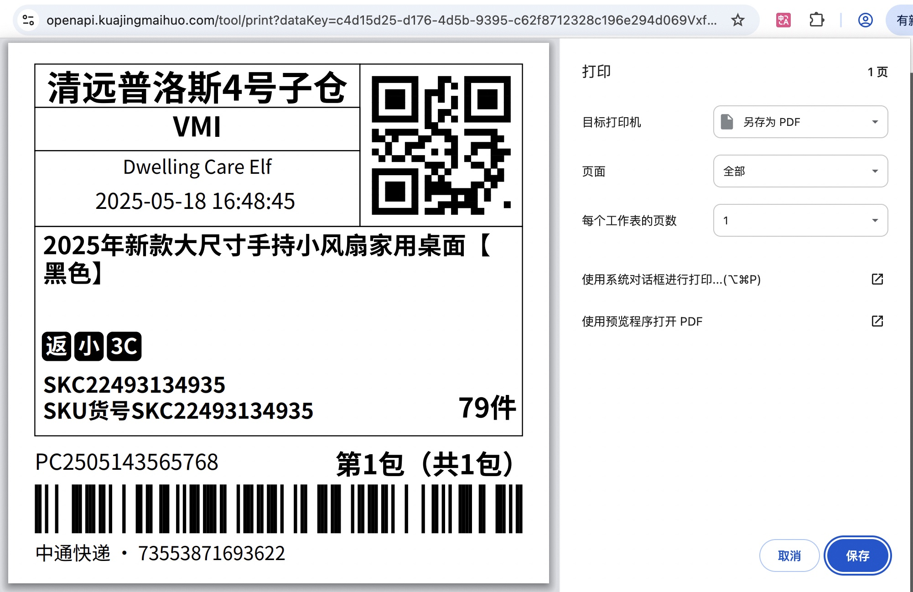
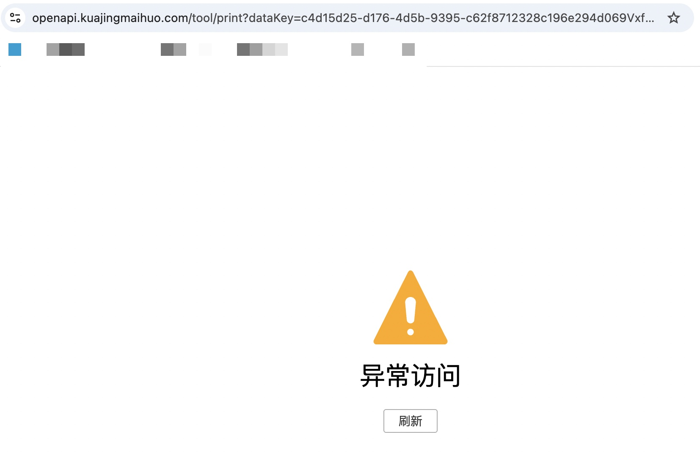

# 箱唛打印说明
- 目录：API文档 / 运单标签&箱唛
- Doc ID：910847737016
- Document ID：142906383832
- 来源：https://agentpartner.temu.com/document?cataId=875198836203&docId=910847737016箱唛打印说明

更新时间：2025-12-04 21:50:10

# 一、参数说明

以下接口可通过传入return\_data\_key=true直接打印

[bg.logistics.boxmarkinfo.get](https://partner.kuajingmaihuo.com/document?cataId=875198836203&docId=910849146238)

[bg.goods.custom.label.get](https://partner.kuajingmaihuo.com/document?cataId=875198836203&docId=913994876441)

[bg.goods.labelv2.get](https://partner.kuajingmaihuo.com/document?cataId=875198836203&docId=913993931973)

**参数名称**

**类型**

**是否必须**

**说明**

return\_data\_key

boolean

否

是否以打印页面url返回，如果入参是，则不返回参数信息，返回dataKey，通过拼接[https://openapi.kuajingmaihuo.com/tool/print?dataKey=](https://openapi.kuajingmaihuo.com/tool/print?dataKey=){返回的dataKey}，访问组装的url即可打印，打印的条码按照入参参数所得结果进行打印

链接10min内单次有效，请求过立即失效

# 二、请求样例

`{ "type": "bg.logistics.boxmarkinfo.get", "timestamp": 1747557947, "app_key": "<REDACTED_APP_KEY>", "data_type": "JSON", "access_token": "<REDACTED_ACCESS_TOKEN>", "deliveryOrderSnList": [ "FH2505142395173" ], "return_data_key": "true", "sign": "<REDACTED_SIGN>" }`

# 三、返回样例

`{ "result": "c4d15d25-d176-4d5b-9395-c62f8712328c196e294d069VxfEVdGWI9fJ4GwmaZ7jHLMJl6CRhczzMOVMjzrfchptzGxYl0fJCuezZcovShi7trgFEc1gEttIIgGEUx18WjHPkper6tRI6dCdqBsicFoJrihjFMUMSslNNXXA9SoARYI0gdtqI9ZPd1VFQAGzrwMinKKVqXeD1TaM0iv1eOVfUBR7eBTWHGhweIsQndywaHmGnv78", "success": true, "requestId": "cn-a0d47628-26f4-479a-adff-aec83159ff8d", "errorCode": 1000000, "errorMsg": "" }`

# 四、箱唛打印样例

`https://openapi.kuajingmaihuo.com/tool/print?dataKey=c4d15d25-d176-4d5b-9395-c62f8712328c196e294d069VxfEVdGWI9fJ4GwmaZ7jHLMJl6CRhczzMOVMjzrfchptzGxYl0fJCuezZcovShi7trgFEc1gEttIIgGEUx18WjHPkper6tRI6dCdqBsicFoJrihjFMUMSslNNXXA9SoARYI0gdtqI9ZPd1VFQAGzrwMinKKVqXeD1TaM0iv1eOVfUBR7eBTWHGhweIsQndywaHmGnv78`

# 五、链接单次有效，再次访问后失效

-   一、参数说明

-   二、请求样例

-   三、返回样例

-   四、箱唛打印样例

-   五、链接单次有效，再次访问后失效
