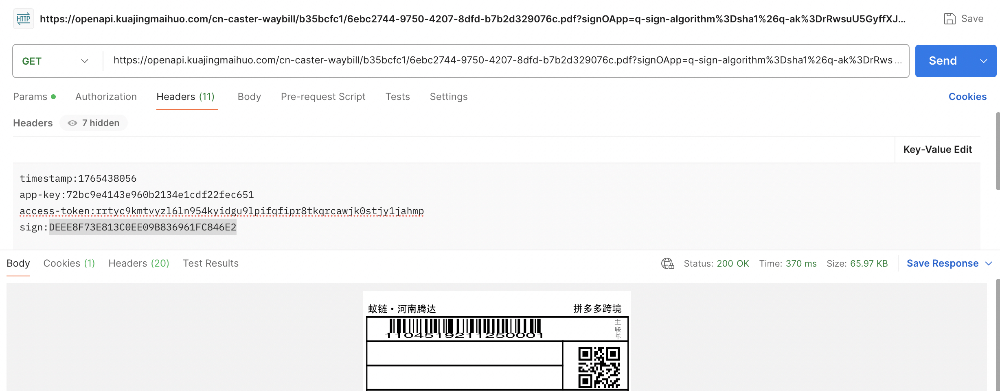

# 运单标签打印说明
- 目录：API文档 / 运单标签&箱唛
- Doc ID：931827203865
- Document ID：163885777959
- 来源：https://agentpartner.temu.com/document?cataId=875198836203&docId=931827203865运单标签打印说明

更新时间：2026-01-08 21:10:34

# 一、查询发货单接口获取快递单

`{"type": "bg.shiporderv2.get", "timestamp": 1765375583, "app_key": "<REDACTED_APP_KEY>", "data_type": "JSON", "access_token": "<REDACTED_ACCESS_TOKEN>", "pageSize": 10, "pageNo": 1, "deliveryOrderSnList": ["FH2509283324004"], "sign": "<REDACTED_SIGN>"} ----返回---- 2025-12-10 22:06:24.032965 {"result":{"total":1,"list":[{"receiveSkcNum":0,"expressPackageNum":1,"latestFeedbackStatus":0,"expectLatestPickTime":null,"expressDeliverySn":"110451921125","deliveryOrderCancelLeftTime":null,"deliveryAddressId":44510209181,"expressWeightFeedbackStatus":0,"expressRejectStatus":0,"packageReceiveInfoVOList":null,"taxWarehouseApplyOperateType":0,"productSkcId":99211925917,"inboundTime":null,"skcExtCode":"TKK-00599","subWarehouseId":884585485737,"packageList":[{"skcNum":10,"packageSn":"PC2509284548004"},{"skcNum":10,"packageSn":"PC2509284548006"}],"inventoryRegion":1,"deliverPackageNum":2,"driverName":"","subPurchaseOrderSn":"WB2509285900002","expressCompanyId":10240055298362,"defectiveSkcNum":0,"status":1,"expectPickUpGoodsTime":1761300000000,"predictTotalPackageWeight":1000,"supplierId":1052202882,"isDisplayCourier":true,"deliveryMethod":2,"isCustomProduct":false,"expressWeightFeedbackTip":null,"exceptionFeedBackTotalCount":0,"otherDeliveryPackageNum":0,"purchaseStockType":0,"ifCanOperateDeliver":false,"receivePackageNum":0,"isPrintBoxMark":true,"expressCompany":"蚁链腾达物流","isClothCategory":false,"deliveryOrderSn":"FH2509283324004","deliverTime":1759042729327,"urgencyType":0,"expressBatchSn":"EB2510241280025","receiveAddressInfo":{"districtCode":43000000000839,"cityName":"肇庆市","districtName":"四会市","phone":"16632289523","provinceCode":43000000000006,"cityCode":43000000000094,"receiverName":"putao","detailAddress":"何多元测试","provinceName":"广东省"},"plateNumber":"","receiveTime":null,"packageDetailList":[{"productSkuId":44160454861,"productOriginalSkuId":null,"personalText":null,"skuNum":10},{"productSkuId":37791500684,"productOriginalSkuId":null,"personalText":null,"skuNum":10}],"subPurchaseOrderBasicVO":{"supplierId":1052202882,"isCustomProduct":false,"productSkcPicture":"https://img.cdnfe.com/product/open/2ec3bee011324459b1e42b440201ed02-goods.jpeg","isFirst":true,"purchaseStockType":0,"isClothCategory":null,"productSkcId":99211925917,"settlementType":1,"skcExtCode":"TKK-00599","subWarehouseId":null,"urgencyType":0,"fragileTag":false,"purchaseQuantity":20,"subWarehouseName":null,"subPurchaseOrderSn":"WB2509285900002","purchaseTime":1759040816781},"subWarehouseName":"南极六仓1号子仓","purchaseTime":1759040816781,"skcPurchaseNum":20,"deliverSkcNum":20,"deliveryOrderCreateTime":1759042106483}]},"success":true,"requestId":"xx","errorCode":1000000,"errorMsg":""}`

# 二、获取运单标签url

`{"type": "bg.shiporder.express.note.get", "timestamp": 1765438004, "app_key": "<REDACTED_APP_KEY>", "data_type": "JSON", "access_token": "<REDACTED_ACCESS_TOKEN>", "pageSize": 10, "pageNo": 1, "deliveryOrderSnList": ["FH2509283324004"], "expressCompanyId": 10240055298362, "expressDeliverySn": "110451921125", "sign": "<REDACTED_SIGN>"} ----返回---- 2025-12-11 15:26:45.751088 {"result":{"tmsChildWaybillSnNoteDetails":[{"childWaybillNote":"https://openapi.kuajingmaihuo.com/cn-caster-waybill/b35bcfc1/6ebc2744-9750-4207-8dfd-b7b2d329076c.pdf?<REDACTED_SIGNED_URL>","childWaybillSn":"1104519211250001"}],"expressCompanyId":10240055298362,"expressDeliverySn":"110451921125"},"success":true,"requestId":"cn-aee2808d-1f45-48ea-9393-03dbd5ecb0ff","errorCode":1000000,"errorMsg":""} `

# 三、生成sign

排序：app-key 、access-token和timestamp三个参数，构建一个map，按ASCII码升序排序

拼接：按照key+value，拼接字符串，前后再拼接app\_secret

签名：MD5加密32位大写

`排序 ['access-token<REDACTED_ACCESS_TOKEN>', 'app-key<REDACTED_APP_KEY>', 'timestamp1765438056'] 拼接 <REDACTED_APP_SECRET>access-token<REDACTED_ACCESS_TOKEN>app-key<REDACTED_APP_KEY>timestamp1765438056<REDACTED_APP_SECRET> 签名 <REDACTED_SIGN>`

# 四、请求样例

`timestamp: 1765438056 app-key: <REDACTED_APP_KEY> access-token: <REDACTED_ACCESS_TOKEN> sign: <REDACTED_SIGN>`

-   一、查询发货单接口获取快递单

-   二、获取运单标签url

-   三、生成sign

-   四、请求样例
