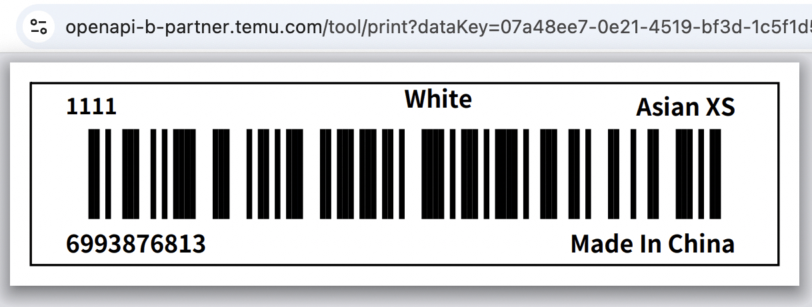
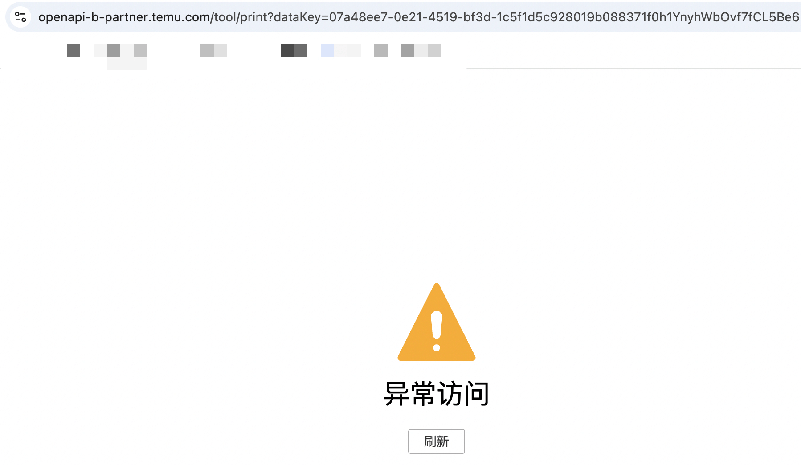

# 条码打印说明
- 目录：API文档 / 商品条码API组-PA
- Doc ID：931825798694
- Document ID：163884783129
- 来源：https://agentpartner.temu.com/document?cataId=875198836203&docId=931825798694条码打印说明

更新时间：2025-12-10 21:49:17

# 一、参数说明

以下接口可通过传入return\_data\_key=true直接打印

[bg.glo.goods.custom.label.get](https://agentpartner.temu.com/document?cataId=875198836203&docId=924483272975)

[bg.glo.goods.labelv2.get](https://agentpartner.temu.com/document?cataId=875198836203&docId=925530254496)

**参数名称**

**类型**

**是否必须**

**说明**

return\_data\_key

boolean

否

是否以打印页面url返回，如果入参是，则不返回参数信息，返回dataKey，通过拼接[https://openapi-b-partner.temu.com/tool/print?dataKey=](https://openapi-b-partner.temu.com/tool/print?dataKey=xxx){返回的dataKey}，访问组装的url即可打印，打印的条码按照入参参数所得结果进行打印

链接10min内单次有效，请求过立即失效

# 二、请求样例

`{     "type": "temu.goods.labelv2.get",     "timestamp": 1765374246,     "app_key": "<REDACTED_APP_KEY>",     "data_type": "JSON",     "access_token": "<REDACTED_ACCESS_TOKEN>",     "productSkuIdList": [         6993876813     ],     "return_data_key": "true",     "sign": "<REDACTED_SIGN>" }`

# 三、返回样例

`{     "result": "07a48ee7-0e21-4519-bf3d-1c5f1d5c928019b088371f0h1YnyhWbOvf7fCL5Be6SqD1BqZXayf2MWPYpfLZ2HVul0HgpuaprOeVVPpVWNnn6pyL18jtBm7R8tIIqpYgrht3Dnk9NIDeLTC051f7tOrmRUDAvTuHfb6cLOnslkuEPzxLV4sBBpIHzbL7pd1Oh6812HKC03kDQs4BNvXxfPTId0CfpXewXY1y6MJFojGzj8z5GhbBH",     "success": true,     "requestId": "pa-04760245-a30e-436a-8e6d-88e6e97c59c1",     "errorCode": 1000000,     "errorMsg": "" }`

# 四、条码打印样例

`https://openapi-b-partner.temu.com/tool/print?dataKey=07a48ee7-0e21-4519-bf3d-1c5f1d5c928019b088371f0h1YnyhWbOvf7fCL5Be6SqD1BqZXayf2MWPYpfLZ2HVul0HgpuaprOeVVPpVWNnn6pyL18jtBm7R8tIIqpYgrht3Dnk9NIDeLTC051f7tOrmRUDAvTuHfb6cLOnslkuEPzxLV4sBBpIHzbL7pd1Oh6812HKC03kDQs4BNvXxfPTId0CfpXewXY1y6MJFojGzj8z5GhbBH`

# 五、链接单次有效，再次访问后失效

-   一、参数说明

-   二、请求样例

-   三、返回样例

-   四、条码打印样例

-   五、链接单次有效，再次访问后失效
