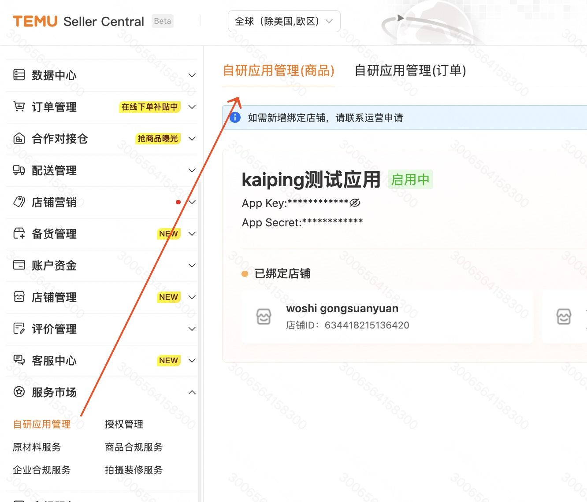
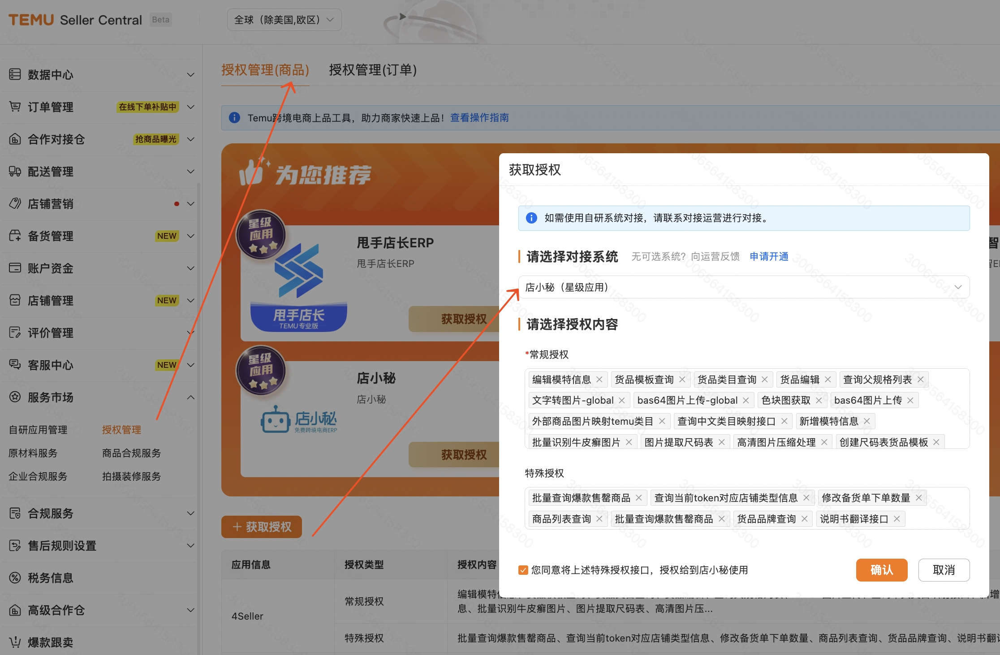

# 鉴权信息
- 目录：开发者文档 / 开发指南
- Doc ID：896168820140
- Document ID：129276807107
- 来源：https://agentpartner.temu.com/document?cataId=875196199516&docId=896168820140鉴权信息

更新时间：2025-07-24 21:47:03

# 一、自研应用如何获取鉴权信息

自研应用

适用场景

获取路径

app\_key

作为接口请求参数，应用维度唯一值，申请应用后不变

GLO卖家中心-->自研应用管理（商品）：[https://agentseller.temu.com/open/apply-app](https://agentseller.temu.com/open/apply-app)

app\_secret

参与签名，申请应用后不变，请谨慎保管，切勿透露给他人，

accesss\_token

作为接口请求参数使用，店铺维度唯一值，请谨慎保管，切勿透露给他人，有效期365天，重新获取后旧accesss\_token失效

GLO卖家中心-->授权管理（商品）--> 选择自研应用名-勾选接口（建议勾选所有）-确认-复制token

[https://agentseller.temu.com/open/system-manage/client-manage](https://agentseller.temu.com/open/system-manage/client-manage)

# 二、三方应用如何获取鉴权信息

三方应用

适用场景

获取路径

app\_key

作为接口请求参数，应用维度唯一值，申请应用后不变

[https://agentpartner.temu.com/main/application-manage](https://agentpartner.temu.com/main/application-manage)

三方应用开发者登陆Partner Platform-应用管理

app\_secret

参与签名，申请应用后不变，请谨慎保管，切勿透露给他人，

accesss\_token

作为接口请求参数使用，店铺维度唯一值，请谨慎保管，切勿透露给他人，有效期90天，重新获取后旧accesss\_token失效

GLO卖家中心-->授权管理（商品）--> 选择自研应用名-勾选接口（建议勾选所有）-确认-复制token

[https://agentseller.temu.com/open/system-manage/client-manage](https://agentseller.temu.com/open/system-manage/client-manage)

# 三、接口鉴权常见报错

鉴权报错优先检查接口地址、app\_key、secret、access\_token是否为同一区

调用CN区接口时，务必使用CN的接口地址、app\_key、secret、access\_token

errorCode

errorMsg

解决方案

7000000

there is no type in body.

入参没传接口type

7000002

there is no app\_key in body.

入参没传app\_key

7000003

there is no access\_token in body.

入参没传access\_token

7000005

app\_key don't have this api permission.

检查app\_key、接口地址是否为同一个区

7000006

access\_token and app\_key are not mapping.

检查app\_key、access\_token是否正确，是否为同一个区

7000007

access\_token is expired, please contact seller to reauthorize and share the new access\_token with you.

access\_token已过期，在卖家中心重新获取授权后重新调用接口

7000008

there is no timestamp in body.

入参没传timestamp

7000010

timestamp is expired.

timestamp十位秒级时间戳，且current\_time-300s<timestamp<current\_time+300s

7000011

timestamp is invalid.

timestamp十位秒级时间戳，且current\_time-300s<timestamp<current\_time+300s

7000013

data\_type is invalid

"data\_type": "JSON",

7000014

there is no sign in body.

入参没传接sign

7000015

sign is invalid, please check your sign calculation

验签未通过，[签名规则](https://agentpartner.temu.com/document?cataId=875196199516&docId=896167235113)

7000016

type not exists.

接口type传值错误，或不在本区

7000018

access\_token not exists.

本合作伙伴平台支持CN区接口的调用，access\_token需要在CN区卖家中心获取；

[https://agentseller.temu.com/open/system-manage/client-manage](https://agentseller.temu.com/open/system-manage/client-manage)

7000019

access\_token don't have this api access, please ask for seller to authorize this api in seller center first，and share the new access\_token with you.

获取access\_token时没有勾选对应的接口，建议全选；

7000020

access\_token invalid.

access\_token错误

7000022

access\_token don't have this api access.

获取access\_token时没有勾选对应的接口，建议全选；

自研专属接口需要联系招商单独申请后调用；

-   一、自研应用如何获取鉴权信息

-   二、三方应用如何获取鉴权信息

-   三、接口鉴权常见报错
