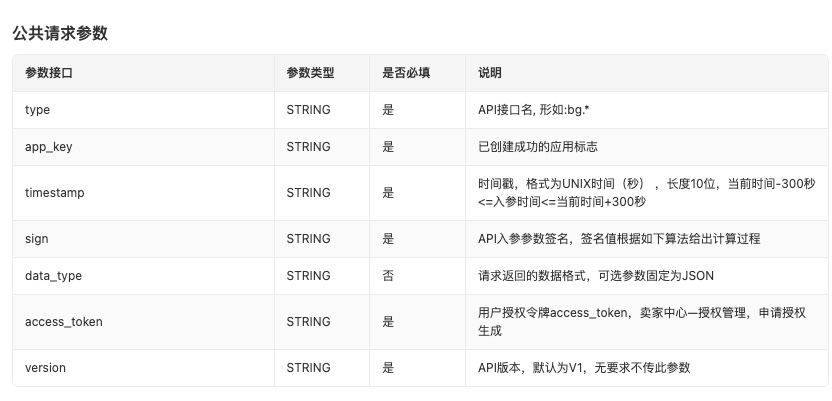
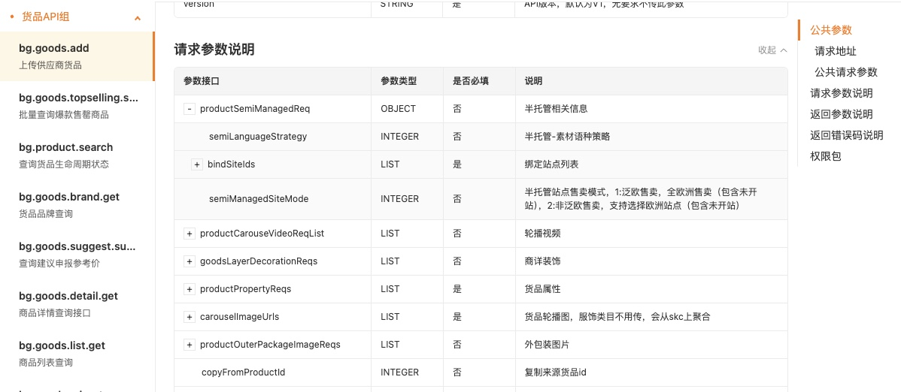

# 基本信息
- 目录：开发者文档 / 开发指南
- Doc ID：897215162233
- Document ID：130322504140
- 来源：https://agentpartner.temu.com/document?cataId=875196199516&docId=897215162233基本信息

更新时间：2026-06-03 15:53:32

# 一、接口地址

CN网关地址

https://openapi.kuajingmaihuo.com/openapi/router

PA网关地址

https://openapi-b-partner.temu.com/openapi/router

PA网关调用说明

[https://agentpartner.temu.com/document?cataId=875198836203&docId=915047650924](https://agentpartner.temu.com/document?cataId=875198836203&docId=915047650924)

请求方式

POST

# 二、场景说明

本平台提供[CN区接口](https://agentpartner.temu.com/document?cataId=875196199516&docId=899312840459)，覆盖场景包括全托半托发品、库存和全托备货履约业务

如需其他场景（如半托订单履约、本本业务）请跳转至其他区域合作伙伴平台

分区说明：[https://agentpartner.temu.com/document?cataId=875196199516&docId=909799935182](https://agentpartner.temu.com/document?cataId=875196199516&docId=909799935182)

US

[https://partner-us.temu.com/](https://partner-us.temu.com/)

EU

[https://partner-eu.temu.com/](https://partner-eu.temu.com/)

GLOBAL

[https://partner.temu.com/](https://partner.temu.com/)

# 三、请求参数

请求参数，包含公共参数和业务参数。跳转至[API接口文档](https://partner.kuajingmaihuo.com/document?cataId=875198836203)

参数

说明

截图

公共参数

调用接口必须传入的通用参数

其中app\_key、secret、token参考[鉴权信息获取](https://agentpartner.temu.com/document?cataId=875196199516&docId=896168820140)

业务参数

各个接口业务相关的参数，每个接口的业务参数不同，以每个接口的对接文档为准，跳转至[API接口文档](https://agentpartner.temu.com/document?cataId=875198836203)

# 四、签名规则

为了防止API调用过程中被恶意篡改，调用API需要携带请求签名，开放平台服务端会根据请求参数，对签名进行验证，对签名不合法的请求，将会拒绝访问。[点击跳转至签名规则](https://agentpartner.temu.com/document?cataId=875196199516&docId=896167235113)。

# 五、测试账号

## 1、全托管测试账号：全托发品、库存、全托履约备货

字段

测试账号1

测试账号2

app\_key

<REDACTED_APP_KEY>

<REDACTED_APP_KEY>

app\_secret

<REDACTED_APP_SECRET>

<REDACTED_APP_SECRET>

accesss\_token

<REDACTED_ACCESS_TOKEN>

<REDACTED_ACCESS_TOKEN>

店铺名称

girl clothes

店铺id

1052202882

## 2、半托管测试账号：半托发品、库存

字段

测试账号1

测试账号2

测试账号3

app\_key

<REDACTED_APP_KEY>

<REDACTED_APP_KEY>

<REDACTED_APP_KEY>

app\_secret

<REDACTED_APP_SECRET>

<REDACTED_APP_SECRET>

<REDACTED_APP_SECRET>

accesss\_token

<REDACTED_ACCESS_TOKEN>

<REDACTED_ACCESS_TOKEN>

<REDACTED_ACCESS_TOKEN>

店铺名称

girl clothesss

woshi gongsuanyuan

店铺id

634418215494106

634418215136420

-   一、接口地址

-   二、场景说明

-   三、请求参数

-   四、签名规则

-   五、测试账号

-   1、全托管测试账号：全托发品、库存、全托履约备货

-   2、半托管测试账号：半托发品、库存
