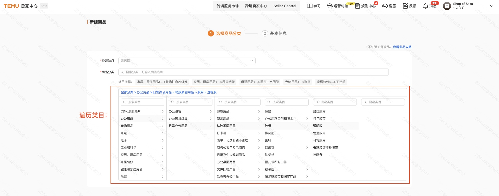
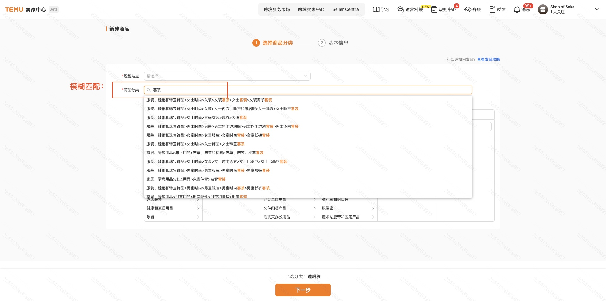
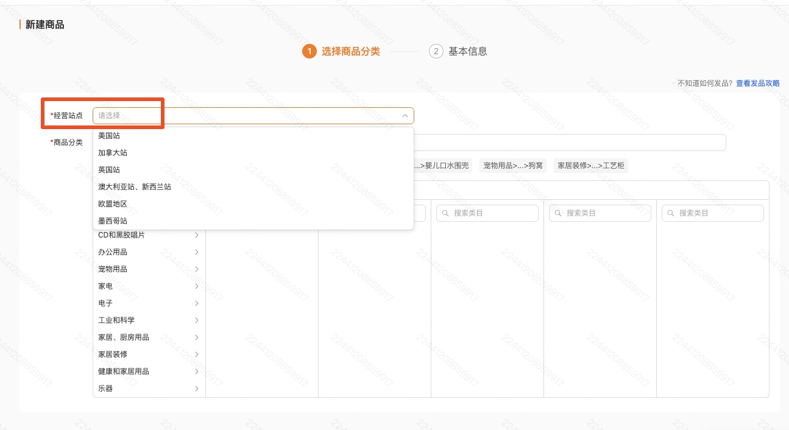
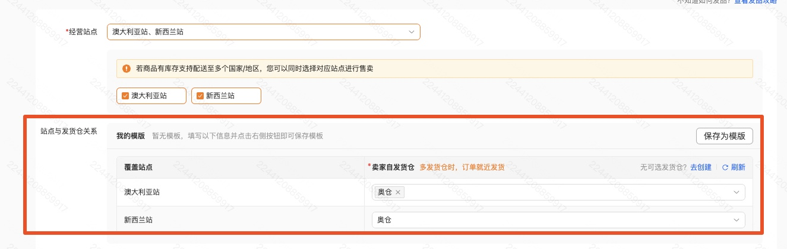
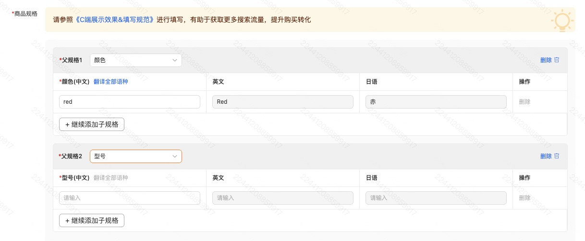
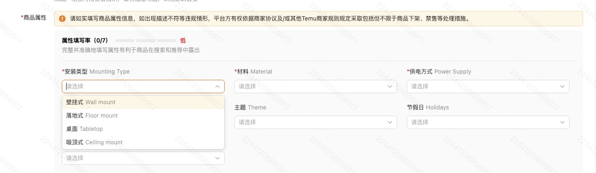

# 货品发布流程
- 目录：开发者文档 / 调用流程
- Doc ID：896172443264
- Document ID：129278535668
- 来源：https://agentpartner.temu.com/document?cataId=875196199516&docId=896172443264货品发布流程

更新时间：2026-04-09 23:29:54

适用范围：全托、半托货品发布

#

一、确定发品类目

发布货品前，需要明确本次发品的叶子类目id

方式一：bg.goods.cats.get，遍历全部类目，通过0查到一级类目，通过一级类目查二级，以此类推，查到叶子类目id和名称

方式二：bg.goods.category.match，通过关键词模糊匹配类目

传入发品接口中的请求参数：从一级类目到叶子类目，其他传0

`{ "cat1Id": 13512, "cat2Id": 15303, "cat3Id": 15823, "cat4Id": 15836, "cat5Id": 0, "cat6Id": 0, "cat7Id": 0, "cat8Id": 0, "cat9Id": 0, "cat10Id": 0 }`

# 二、确认站点、仓库、运费模版（全托店铺跳过本步骤）

2-1. 确认发品站点： [半托管站点列表](https://agentpartner.temu.com/document?cataId=875196199516&docId=893022798763)

2-2. 查询站点对应的仓库：bg.goods.warehouse.list.get，bg.btg.goods.stock.warehouse.list.get

2-3. 查询站点对应的运费模板：bg.logistics.template.get

# 三、查询属性模版

将第一步的叶子类目id作为请求参数，查询bg.goods.attrs.get获取类目对应的属性模板

##

3-1. 货品规格

规格是销售属性，不同的规格值决定了sku，需要满足笛卡尔积关系，即sku数量=规格1的规格值数量\*规格2的规格值数量

举例：颜色：红色、黑色；尺码：S、M、L，那么sku必须为6个，即红色S、红色M、红色L、黑色S、黑色M、黑色L

inputMaxSpecNum：模板允许的最大的自定义规格数量

**情况一****：**inputMaxSpecNum=0，不允许自定义规格，只能用属性模板返回的isSale=ture销售属性作为规格，在发品接口中传入

**情况二****：**inputMaxSpecNum=n(n≠0)允许自定义规格，通过bg.goods.parentspec.get查询父规格，从中选n个父规格，再通过bg.goods.spec.create生成子规格

在发品接口的productSpecPropertyReqs传入规格

##

3-2. 货品属性

isSale=false为普通属性，required=true为必填，注意父子属性需要单独适配

在发品接口的productPropertyReqs传入，取值参考如下：

`"productPropertyReqs"：[ { "templatePid": 197127, //取properties.templatePid "pid": 3, //取properties.pid "refPid": 19, //取properties.refPid "propName": "风格", //取properties.name "vid": 2076, //取properties.values.vid "propValue": "现代", //取properties.values.value "valueUnit": "", //取properties.valueUnit "numberInputValue":"" // } ]`

# 四、尺码表

##

4-1. 查尺码表分类

bg.goods.sizecharts.class.get，通过叶子类目catId查到对应的尺码表分类classId

当classType=1时为套装，需要关注relatedClassIds，将relatedClassIds中的值作为classId使用，套装要求至少传入2个尺码表

##

4-2. 尺码表是否必填

bg.goods.sizecharts.class.get，确定尺码表是否必填，如接口有返回，则为必填

##

4-3. 查询尺码表规则

bg.goods.sizecharts.meta.get，关注groupList和elementList，相当于尺码表的列名

bg.goods.sizecharts.settings.get，关注sizeList

##

4-4. 创建尺码表

方式一：bg.goods.sizecharts.create，reusable=true创建可复用尺码表，即尺码表模板（等同于用bg.goods.sizecharts.get查到的在卖家中心后台创建的尺码表模板）；

再用businessId通过bg.goods.sizecharts.template.create生成tempBusinessId，作为发品入参使用

方式二：bg.goods.sizecharts.create，reusable=false创建不可复用尺码表，接口返回的businessId可直接发品入参使用

**套装（classType=1）时创建尺码表不传catid**

注意：尺码表中的records数量和值必须与发品接口中的尺码保持一致

## 4-5. 尺码表样例

`----请求---- {"type": "bg.goods.sizecharts.create", "timestamp": 1751012517, "app_key": "<REDACTED_APP_KEY>", "data_type": "JSON", "access_token": "<REDACTED_ACCESS_TOKEN>", "catId": 29069, "classId": 5, "content": {"generalSizeType": 1, "localSizeSource": 1, "meta": {"elementList": [{"id": 10002, "name": "胸围全围"}, {"id": 10003, "name": "衣长"}], "groupList": [{"id": 1, "name": "尺码"}]}, "records": [{"values": {"1": "S", "10002": "60", "10003": "60"}}]}, "name": "test", "reusable": false, "sign": "<REDACTED_SIGN>"} ----返回---- {"result":{"businessId":17593393795048},"success":true,"requestId":"cn-d16a7574-3951-4b2f-90ed-21e48cf9978f","errorCode":1000000,"errorMsg":""}`

#

五、图片和视频

图片和视频，需要先使用平台提供的上传接口，使用上传接口返回的URL作为发品入参

[图片处理API组](https://agentpartner.temu.com/document?cataId=875198836203&docId=929743122710)

[视频上传API组](https://agentpartner.temu.com/document?cataId=875198836203&docId=917139576842)

# 六、货品skc

## 6-1. 货品结构说明

spu-skc-sku，对应的货品id在调用发品接口成功后返回

货品

解释说明

对应发品接口返回参数字段

规则

spu

一次接口请求相当于一个spu

productId

一个SPU下最多25个SKC，每个SKC下的SKU数量无限制；

一个SPU下最多500个SKU

skc

非服饰类目只传一个skc

服饰类目，几个颜色对应几个skc

productSkcId

sku

一个skc下可以传多个sku

productSkuId

## 6-2. 主销售属性

mainProductSkuSpecReqs

非服饰类目固定传值：

`[{"parentSpecId":0,"parentSpecName":"","specId":0,"specName":""}]`

服饰类目传入颜色，例如：

`[{"specId":3002,"parentSpecName":"颜色","parentSpecId":1001,"specName":"黑色"}]`

# 七、发品样例

[https://agentpartner.temu.com/document?cataId=875198836203&docId=909798859447](https://agentpartner.temu.com/document?cataId=875198836203&docId=909798859447)

# 八、FAQ

8-1. "主销售属性不合法"

非服饰固定传值："mainProductSkuSpecReqs":\[{"parentSpecId":0,"parentSpecName":"","specId":0,"specName":""}\]

8-2. "尺码表包含不合法的尺码规格"

发品的尺码必须和尺码表中的尺码一致，例如发品传入S、M、L三种尺码，那么尺码表必须为S、M、L三种尺码

8-3. “URL域名校验不通过或URL包含不合法字符串"

图片视频需要先调用上传接口，将返回的URL作为发品接口入参，详见【五、图片和视频】

8-4. “主销售规格属性值列表重复”

非服饰只能传入一个skc

8-5. "服饰类目skc轮播图xxx校验失败，应符合宽高比例为xxx"

图片校验是使用图片上传接口的base64原图做校验，请商家排查base64**原图**是否符合接口返回提示的要求

8-6. "不合法的尺码模板id：\[0\]"

showSizeTemplateIds和sizeTemplateIds，没有尺码表时传空数组\[\]

8-7. "不合法的尺码模板id：\[123456\]"

bg.goods.sizecharts.get返回的id**不能直接作为发品入参使用**，需要通过bg.goods.sizecharts.template.create生成tempBusinessId

详细见【4-4. 创建尺码表】方式一

8-8. “当前商品仅允许填写分站点申报价格”

申报价字段，全托半托字段不同

半托只传siteSupplierPrices，不允许传supplierPrice

全托只传supplierPrice，不允许传siteSupplierPrices

8-9. “分站点申报价格站点信息错误”

半托管检查productSemiManagedReq字段

8-10. 属性模版接口返回为空，没有属性数据

请检查入参的catId，要求传入叶子类目

（货品类目接口bg.goods.cats.get返回的isLeaf=true为叶子类目）

8-11. "不允许创建套装模板"

套装（classType=1）时创建尺码表不传catid

8-12. "货品类目属性更新，请刷新页面后重新创建货品"

报错原因：请求中传入的属性有缺失

解决方案：重新拉取属性模板（bg.goods.attrs.get），比对返回的属性，找到缺失的属性值并重新传参；或在卖家中心页面发品选择属性和对应的属性值后，定位缺失的属性；

8-13. “Semi-managed delivery information cannot be empty”

运费模板没传，样例

"productShipmentReq": {

"freightTemplateId": "HFT-16961217732280430733",

"shipmentLimitSecond": 86400

},

-   一、确定发品类目

-   二、确认站点、仓库、运费模版（全托店铺跳过本步骤）

-   三、查询属性模版

-   3-1. 货品规格

-   3-2. 货品属性

-   四、尺码表

-   4-1. 查尺码表分类

-   4-2. 尺码表是否必填

-   4-3. 查询尺码表规则

-   4-4. 创建尺码表

-   4-5. 尺码表样例

-   五、图片和视频

-   六、货品skc

-   6-1. 货品结构说明

-   6-2. 主销售属性

-   七、发品样例

-   八、FAQ
