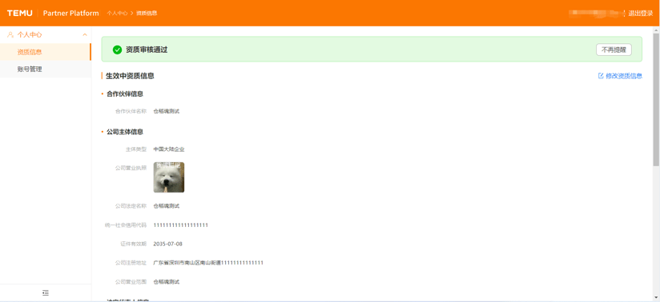
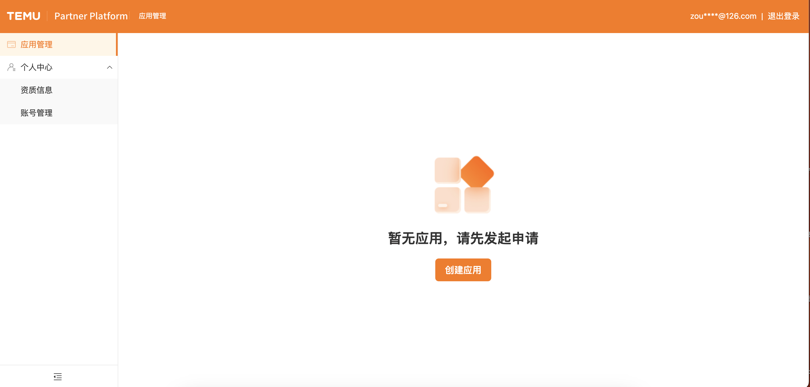
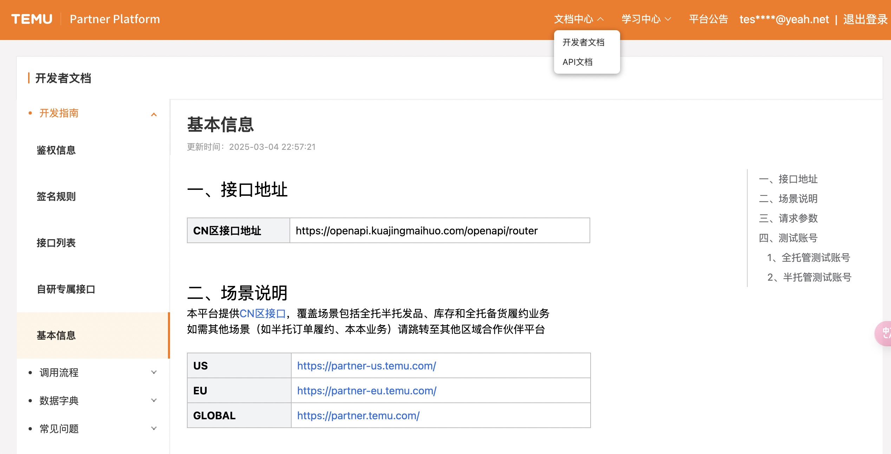
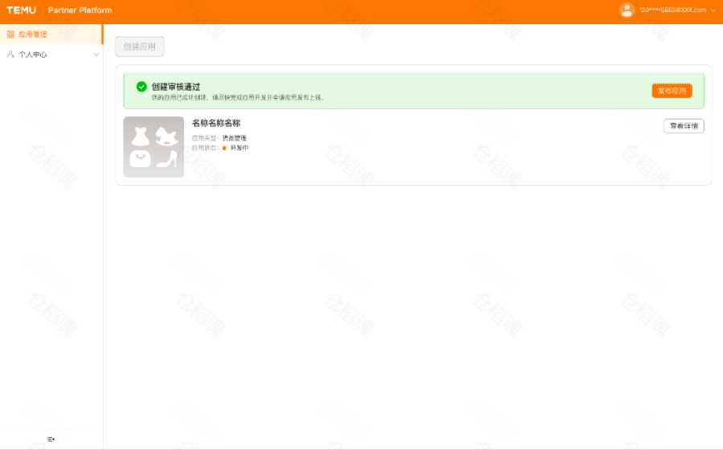
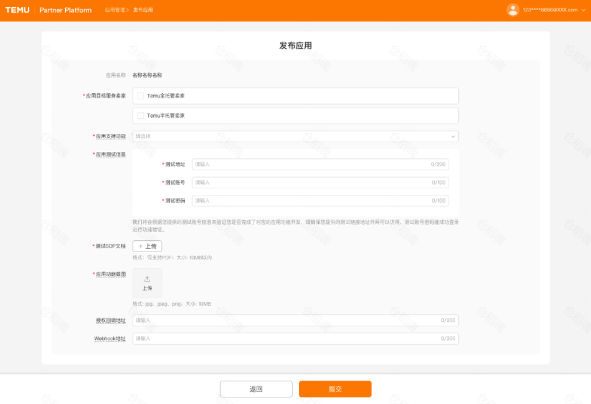
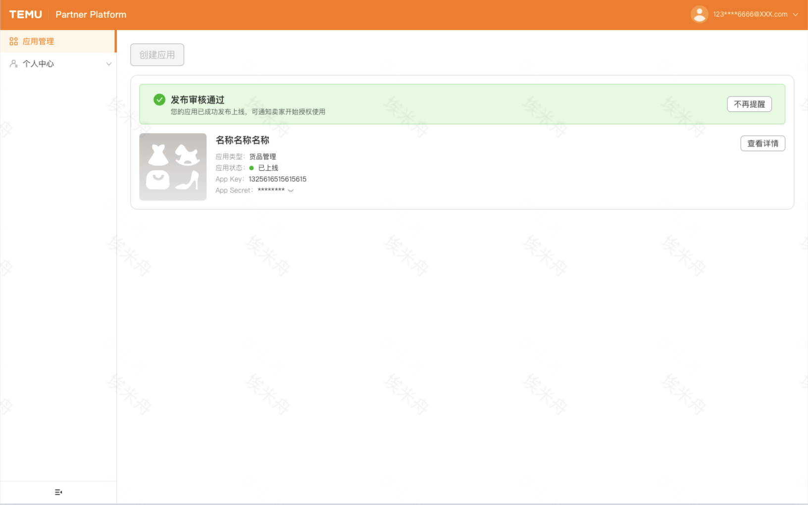
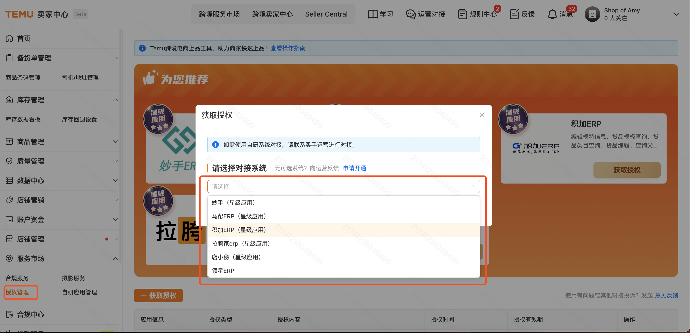
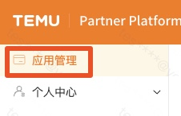
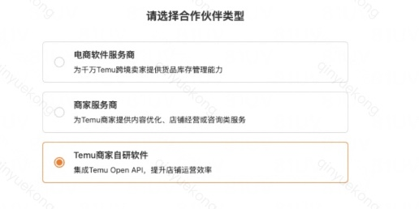

# 入驻流程说明
- 目录：开发者文档 / 入驻流程
- Doc ID：903508418346
- Document ID：136614434571
- 来源：https://agentpartner.temu.com/document?cataId=875196199516&docId=903508418346入驻流程说明

更新时间：2026-01-28 15:17:14

欢迎您加入TEMU合作伙伴平台！为了帮助您快速完成入驻并开始使用平台接口服务，请详读以下内容。您也可通过右侧目录快速导航。

# 一、平台简介

本平台提供TEMU在CN区的接口能力，覆盖场景包括全托半托发品、库存和全托备货履约业务

如需其他场景（如半托订单履约、本本业务）请跳转至其他区域合作伙伴平台，点击[分区说明](https://agentpartner.temu.com/document?cataId=875196199516&docId=909799935182)了解更多分区情况

US

[https://partner-us.temu.com/](https://partner-us.temu.com/)

EU

[https://partner-eu.temu.com/](https://partner-eu.temu.com/)

GLOBAL

[https://partner.temu.com/](https://partner.temu.com/)

# 二、角色介绍

合作伙伴角色

应用角色说明

入驻流程

电商软件服务商

即三方ERP，主要为Temu商家提供ERP等软件应用服务，入驻后，TEMU商家可在卖家中心后台选到您的应用，并获取授权

主体入驻->应用创建->应用上线

具体步骤参考下文中的「四、电商软件服务商入驻SOP」

Temu商家

即自研应用，Temu商家为了实现自研系统跟Temu跨境卖家中心的数据同步，授权信息仅允许本主体的店铺使用

CN区的自研应用联系对接招商申请

应用申请后参考下文中的「五、Temu商家入驻SOP」绑定

# 三、流程说明

# 四、电商软件服务商入驻SOP

## **第一步：完成资质审核**

1.选择合作伙伴类型：电商软件服务商

2.提交合作伙伴主体入驻申请

-   支持“中国内地企业”入驻，需填写公司营业执照/法人身份信息/管理身份信息。
-   支持“中国香港企业“入驻，需填写公司注册证/商业登记证/银行账户/开户证明/法人身份信息/管理员身份信息。
-   注意：填写字段需和上传的营业执照图片上一致，否则入驻申请会被驳回，如对审核结果有疑议，可联系开放平台技术支持团队处理。

3.查看合作伙伴主体入驻审核结果

4.更新资质信息

-   主体入驻审核通过后，主体类型和统一社会信用代码不可修改
-   更新合作伙伴信息/公司主体信息/法定代表人信息/管理员信息需发起资质变更申请
-   更新管理员邮箱/电话/其他信息可直接变更生效

## **第二步：创建应用**

1.发起创建应用申请

-   请务必准确填写您的成功应用软件的开发经验，并提供相关的应用网站链接，应用在其他电商平台服务市场的上线截图，应用在其他电商平台应用管理模块上线凭证，并说明清楚您的软件的MRD文档和PRD等设计文档帮助我们更好的了解你们的开发计划。

-   每个主体只能申请创建一个货品管理的三方应用

2.查看应用创建申请结果

-   创建审核驳回：常见原因：应用说明不准确/缺失与其他平台对接信息，开发者可更新补充材料后再次发起应用创建申请

_温馨提示：驳回后，如没有任何修改，请不要重新提交申请，以免影响审核结果。请仔细阅读平台要求后，按照要求提交素材后再次申请_

-   创建审核通过：可以开始进行Open API接口对接

## **第三步：应用开发和测试**

点击[【文档中心】-【开发者文档】](https://partner.kuajingmaihuo.com/document?cataId=875196199516)可跳转查看对接信息、流程，文档在主体入驻审核通过后有权查看

点击[【文档中心】-【API文档】](https://agentpartner.temu.com/document?cataId=875198836203&docId=875202591662)可跳转API接口文档，文档在主体入驻审核通过后有权查看

## **第四步：发布上线应用**

1.发起应用上线申请

-   请务必保证提供平台验收的软件测试地址和测试账号在外网可访问，确认相关功能已经开发测试完成具备开放上线的能力

2.查看应用上线申请结果

-   上线审核驳回/异常：常见原因：测试系统无法登录/测试地址中无相关接口功能和数据，开发者可更新补充材料后再次发起应用上线申请

_温馨提示：驳回后，如没有任何修改，请不要重新提交申请，以免影响审核结果。请仔细阅读平台要求后，按照要求提交素材后再次申请_

-   上线审核通过：Temu全托/半托卖家可以在跨境卖家中心CN区授权管理页面搜索授权此应用。

# 四、Temu商家入驻SOP

## 第一步：自研应用申请

请商家联系招商运营申请

## 第二步：绑定自研应用

1、应用申请成功后，使用主账号登录到[跨境卖家中心](https://seller.kuajingmaihuo.com/)

2、登陆本平台，点击【应用管理】，选择“Temu商家自研软件”，跳转至卖家中心授权入驻

# 五、查看接口文档

接口文档不允许游客查看，三方主体入驻成功或自研应用绑定应用后，可查下以下文档

点击[【文档中心】-【开发者文档】](https://agentpartner.temu.com/document?cataId=875196199516&docId=897215162233)可跳转查看对接信息、流程

点击[【文档中心】-【API文档】](https://agentpartner.temu.com/document?cataId=875198836203&docId=875202591662)可跳转API接口文档

#

-   一、平台简介

-   二、角色介绍

-   三、流程说明

-   四、电商软件服务商入驻SOP

-   第一步：完成资质审核

-   第二步：创建应用

-   第三步：应用开发和测试

-   第四步：发布上线应用

-   四、Temu商家入驻SOP

-   第一步：自研应用申请

-   第二步：绑定自研应用

-   五、查看接口文档
